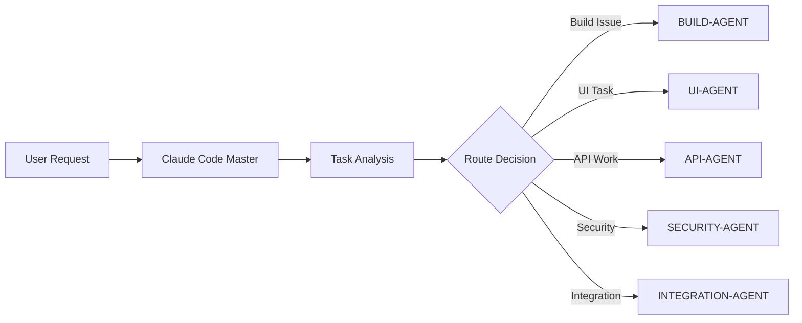

# ATP Agent Orchestration Workflow

## Claude Code → BMAD-METHOD Integration Protocol

### Phase 1: Task Reception & Analysis


### Phase 2: BMAD-METHOD Handoff

#### Handoff Protocol
1. **Claude Code Subagent** analyzes task complexity
2. **Creates BMAD Work Package**:
   ```json
   {
     "task_id": "ATP-2025-XXX",
     "priority": "critical|high|normal",
     "bmad_agents": ["dev", "qa", "architect"],
     "requirements": {...},
     "acceptance_criteria": [...],
     "timeline": "sprint_7_days"
   }
   ```
3. **Triggers BMAD-METHOD** via `.cursorrules` activation
4. **Monitors progress** through scratchpad updates

### Phase 3: Execution Flow

#### BUILD-AGENT Workflow
```yaml
trigger: Production build failure
steps:
  1. analyze:
      agent: bmad-analyst
      action: Identify build blockers
  2. design:
      agent: bmad-architect
      action: Design fix strategy
  3. implement:
      agent: bmad-dev
      action: Execute fixes
  4. validate:
      agent: bmad-qa
      action: Test build pipeline
  5. report:
      agent: Claude Code
      action: Update scratchpad & user
```

#### UI-AGENT Workflow
```yaml
trigger: UI component request
steps:
  1. requirements:
      agent: bmad-po
      action: Define user stories
  2. design:
      agent: bmad-ux-expert
      action: Create mockups/flows
  3. implement:
      agent: bmad-dev
      action: Build React components
  4. test:
      agent: bmad-qa
      action: UI/UX testing
  5. integrate:
      agent: Claude Code
      action: Merge to main
```

#### API-AGENT Workflow
```yaml
trigger: Backend service modification
steps:
  1. analyze:
      agent: bmad-analyst
      action: API requirements
  2. architect:
      agent: bmad-architect
      action: Service design
  3. develop:
      agent: bmad-dev
      action: Implement endpoints
  4. test:
      agent: bmad-qa
      action: Integration tests
  5. document:
      agent: bmad-pm
      action: Update API docs
```

### Phase 4: Coordination & Monitoring

#### Status Tracking
- **Scratchpad Updates**: Real-time progress in `.cursor/scratchpad.md`
- **Todo Lists**: Managed via TodoWrite tool
- **Project Board**: Track in `PROJECT_STATUS_BOARD.md`
- **Audit Trail**: Log all agent actions

#### Communication Protocol
```typescript
interface AgentMessage {
  from: 'claude-code' | 'bmad-method';
  to: string;
  type: 'task' | 'status' | 'result' | 'error';
  payload: {
    task_id: string;
    content: any;
    timestamp: Date;
    priority: 'critical' | 'high' | 'normal' | 'low';
  };
}
```

### Phase 5: Quality Gates

#### Acceptance Criteria
1. **Build Tasks**:
   - ✅ npm run build succeeds
   - ✅ Docker build completes
   - ✅ CI/CD pipeline green
   - ✅ No TypeScript errors

2. **UI Tasks**:
   - ✅ Component renders correctly
   - ✅ Responsive design works
   - ✅ Accessibility standards met
   - ✅ Performance benchmarks passed

3. **API Tasks**:
   - ✅ All tests pass
   - ✅ API documentation updated
   - ✅ Security validation complete
   - ✅ Performance SLAs met

## Current Sprint Priorities (from Scratchpad)

### Track A - Critical Build Fixes (BUILD-FIX.1)
**Owner**: BUILD-AGENT → bmad-dev + bmad-qa
- BUILD-FIX.1.1: PostCSS toolchain in production
- BUILD-FIX.1.2: Resolve @/* alias in prod/Docker
- BUILD-FIX.1.3: Fix Docker build context
- BUILD-FIX.1.4: CI build guard

### Track B - Visual Trust Policy Editor (UI-MOD.3)
**Owner**: UI-AGENT → bmad-ux-expert + bmad-dev
- UI-MOD.3.1: Scaffold React Flow canvas
- UI-MOD.3.2: Node palette + placement
- UI-MOD.3.3: Policy JSON schema validation

### Track C - Policy Storage API
**Owner**: API-AGENT → bmad-architect + bmad-dev
- POL-API.1: CRUD endpoints
- POL-API.2: Versioning + audit

### Track D - Audit Logger IPFS
**Owner**: SECURITY-AGENT → bmad-dev
- Replace legacy IPFS with Helia
- Feature toggle implementation

### Track E - End-to-End Workflow
**Owner**: INTEGRATION-AGENT → bmad-qa + bmad-sm
- SDK-based flow validation
- Documentation of green path

## Activation Commands

### To start a specific track:
```bash
# For build fixes
claude-code activate BUILD-AGENT --track A

# For UI development
claude-code activate UI-AGENT --track B

# For API work
claude-code activate API-AGENT --track C
```

### To trigger BMAD-METHOD agent:
```bash
# Direct BMAD invocation
bmad-method --agent dev --task "BUILD-FIX.1.1"

# Through Claude Code
claude-code delegate --to bmad-dev --task "BUILD-FIX.1.1"
```

## Success Metrics

1. **Build Health**: 100% green CI/CD
2. **Test Coverage**: >80% across all services
3. **Performance**: <200ms API response time
4. **Security**: Zero critical vulnerabilities
5. **Documentation**: 100% API coverage

## Notes for Seamless Workflow

- Claude Code subagents handle high-level orchestration
- BMAD-METHOD agents execute specialized tasks
- Scratchpad serves as shared state
- Todo lists track granular progress
- Automatic handoffs based on task type
- Continuous monitoring and reporting